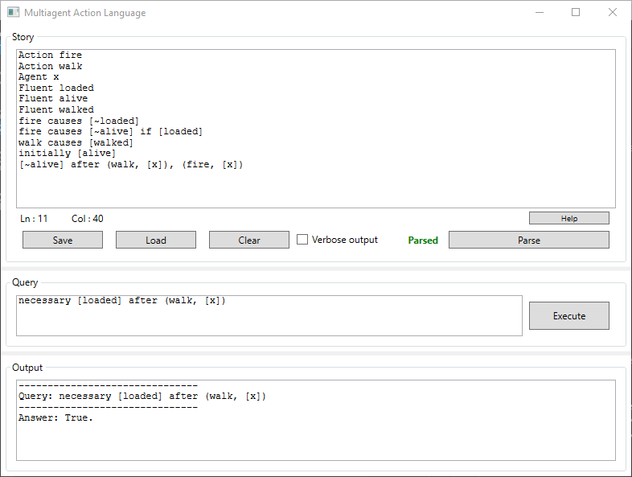

# Multiagent-Action-Language



## Summary
Framework for multiagent reasoning from actions written entirely in C#. This implementation extents AR action language (actions with ramifications) on multiple agents. Main assumpions of this action language are:
1. Inertia law
2. Sequencing of actions
3. Nondeterminism of actions

## Implementation features
### Forward chaining
Obviously, this implementation allows for forward chaining. E.g. for domain:
```
Fluent R1
Fluent R2
Fluent R3
Agent g1
Agent g2
Agent g3
Agent g4
Action A1
Action A2
A1 by [g1, g3, g4] causes [R1]
A1 by [g1, g3] causes [R3]
A2 by [g3, g4] causes [R2]
```
and query:
```
possibly [g2] engaged in (A1, [g1, g2, g3, g4]),(A2, [g2, g3, g4])
```
App returns *false*, as suspected with respect to definition.

### Backward chaining
This implementation allows not only forward chaining but also backward chaining. E.g. for domain:
```
Action fire
Action walk
Agent x
Fluent loaded
Fluent alive
Fluent walked
fire causes [~loaded] 
fire causes [~alive] if [loaded] 
walk causes [walked]
initially [alive] 
[~alive] after (walk, [x]), (fire, [x])
```
and query:
```
necessary [loaded] after (walk, [x])
```
App returns *true*, as fluent *loaded* in really necessary after *walk* action, for fluent *alive* to be *false*. 

## Authors
* [pkonowrocki](github.com/pkonowrocki) Piotr Konowrocki <piotrek.konowrocki@gmail.com>
* [ArkadyPL](github.com/ArkadyPL)
* [kocu13](github.com/kocu13)
* [zegadlok](github.com/zegadlok)
* [omelanczukm](github.com/omelanczukm)
* [mazurkiewiczj](github.com/mazurkiewiczj)
* [dawidlazuk](github.com/dawidlazuk)
* [bpolak00](github.com/bpolak00)

## Final remarks
This project was realized as a part of Knowledge Representation course at Faculty of Mathematics and Information Science at WUT, and was rated 20/20 points by dr Anna Maria Radzikowska.